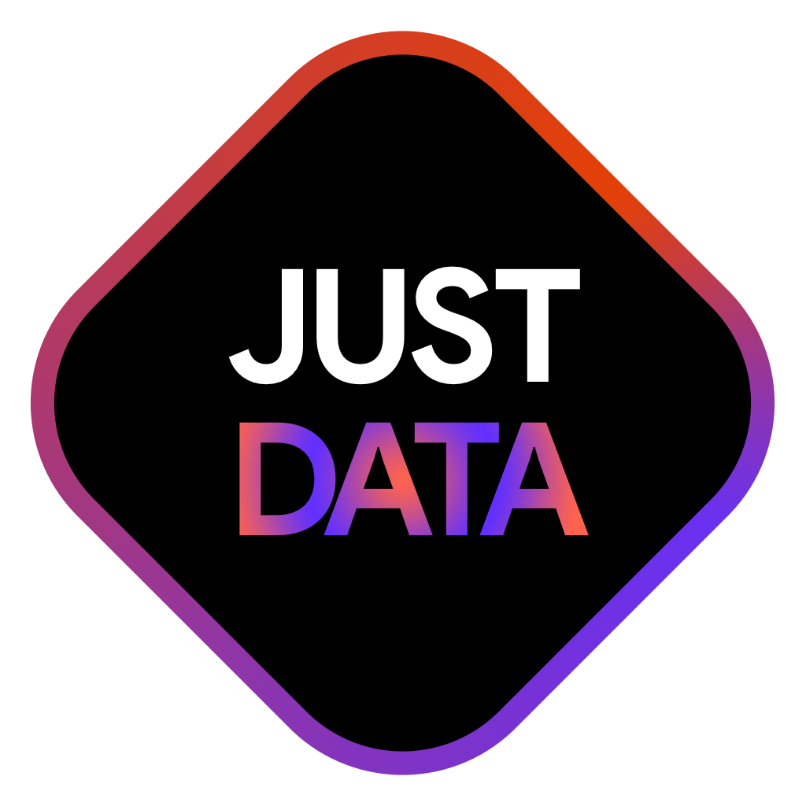

# JustData

|  | Scraping the web, and collecting just data |
| ----------------------------------------- | ------------------------------------------ |

- [JustData](#justdata)
  - [What is Just Data?](#what-is-just-data)
  - [Scraping Rules](#scraping-rules)

## What is Just Data?

Just Data is a data collection tool which scrapes the web to collect just data. The server provides a series of API endpoints which perform the scraping activities and caches the results. A client web application is provided to beautifully display the scraped data.

The web application makes it simple to browse and visualize data from various sources, along with downloading the data for external use.

## Scraping Rules

Scraping websites for valuable information is perfectly legal, but it has its limitations. All web scraping practices must conform to U.S. Federal Law in addition to the rules outlined here:

1. Any data can be scraped if it legal to do so and does not violate any of the following rules.
2. The project **must not** bypass any firewalls or paywalls, with the following exceptions:
    1. The project can bypass a paywall if the paywall is simply an element covering the entire website, and does not block the actual content from loading.
    2. All that is required to load protected content is an API call, or invoking a JavaScript function.
    3. The scraper logs in to the website being scraped to access the protected content.
        1. The login credentials must not be hard-coded, but rather loaded from secrets or environment variables.
        2. The login crednetials must be created legitimately through the vendor site.
    4. The firewall provides simply redirects to another public-facing URL.
3. This project strictly prohibits scraping data from internal business applications, even when using legitimate company credentials.
4. This project **strictly** prohibits scraping data from internal government software, even when using legitimate government credentials. The following exceptions apply:
    1. A U.S. State government has sanctioned data collection from their internal server(s);
    2. The U.S. Federal government has sanctioned data collection from their internal server(s);
    3. The U.S. Federal government (DOD/DOJ) has sanctioned data collection from servers outside of the U.S.;
5. Scraping private data on individuals is strictly prohibited, with the following exceptions:
    1. The data being collected is on public figure;
    2. The data being collected lies in the public domain or public government records;
    3. The data does not contain social security or tax identification numbers;
    4. The data is not attached to a child or minor;
    5. When the data is attached to a currently incarcerated convicted felon, the above rules do not apply;
    6. When the data is attached to a fugitive or terrorist, the above rules do not apply.
